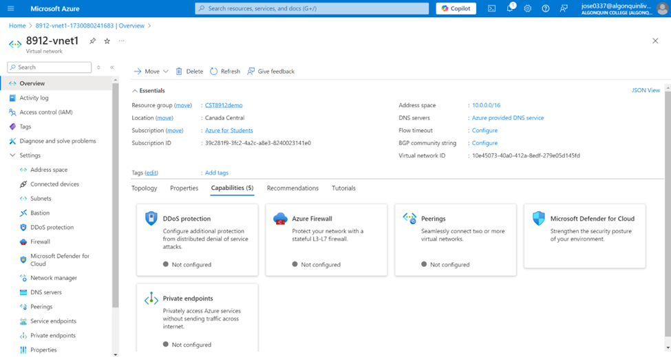
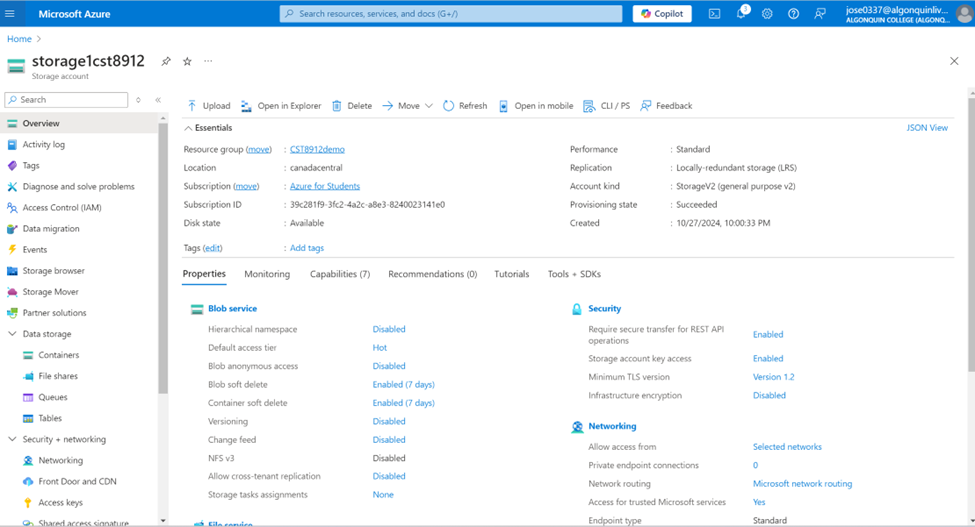
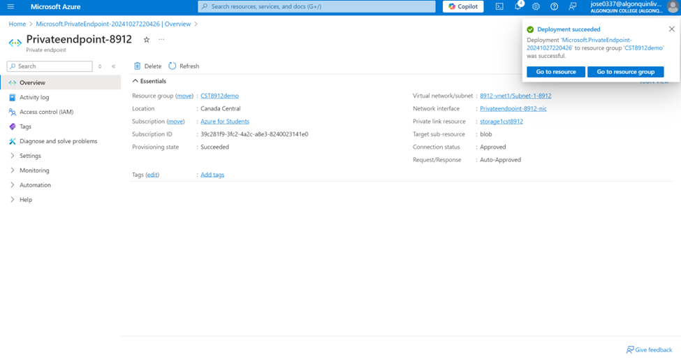
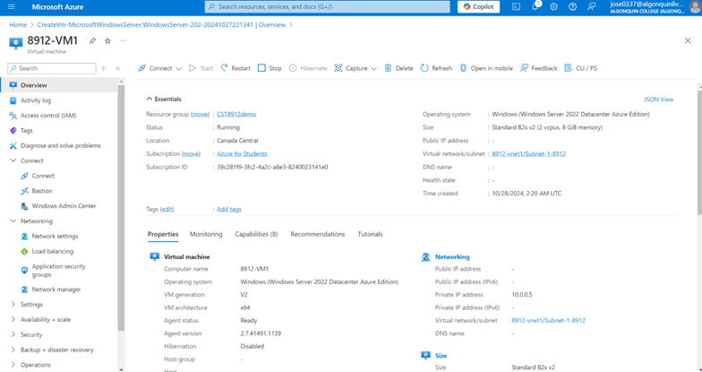
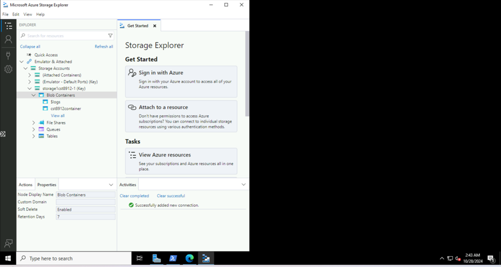
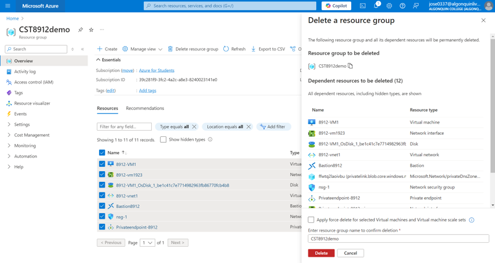

# CST8912 – Cloud Solution Architecture: Graded Lab Activity #6

---

### Overview

This lab focuses on implementing a private and secure connection within Azure using **Azure Private Link** and **Private Endpoint**. Azure Private Link allows private connectivity from a virtual network to Azure services, Microsoft Partner services, or custom services, eliminating the need to expose resources to the public internet. Private Endpoint provides secure connectivity to specific resources like storage accounts within the virtual network, ensuring data privacy and minimizing the risk of unauthorized access. 

The lab simulates a typical setup for creating a private endpoint in Azure, configuring a virtual network, storage account, and a virtual machine. This hands-on experience is designed to illustrate how cloud architectures can securely connect resources within a cloud provider's ecosystem.

---

### Key Objectives

1. **Understand Cloud Solution Design Patterns:** Differentiate between public, private, hybrid, and multi-cloud solution design patterns, analyzing their advantages, disadvantages, and security implications.
   
2. **Configure Azure Private Link and Private Endpoint:** Gain hands-on experience in setting up and configuring Azure Private Link to restrict data flow to private Azure services.

3. **Establish Secure Storage Access:** Set up a private storage endpoint to restrict access to a storage account from within a virtual network.

4. **Test and Validate Connectivity:** Verify connectivity to the storage account via a private IP address from a virtual machine, ensuring isolation from public internet exposure.

---

### Steps to Complete the Lab

#### 1. **Create a Virtual Network and Bastion Host**
   - Provision a virtual network named `8912-vnet1` in the **Canada Central** region.
   - Enable Azure Bastion, a secure service allowing RDP/SSH access to virtual machines without a public IP.

   

#### 2. **Create a Storage Account**
   - Create a storage account named `Storage1-8912` with Local Redundant Storage (LRS) redundancy.
   - Configure the storage account for private access only by disabling public access.

  

#### 3. **Set Up a Private Endpoint**
   - Create a private endpoint named `Privateendpoint-8912` to connect the virtual network `8912-vnet1` to the storage account `Storage1-8912`.
   - Use **Microsoft.Storage/storageAccounts** as the resource type and select `blob` as the subresource target.

  

#### 4. **Create and Configure a Virtual Machine**
   - Deploy a virtual machine named `8912-VM1` in `8912-vnet1`, configuring it with a Windows Server 2022 image.
   - Remove public IP access, enforcing access only through the private network.

     

#### 5. **Verify Private Connectivity to Storage Account**
   - Connect to `8912-VM1` using Azure Bastion and execute an `nslookup` command to confirm that the storage account resolves to a private IP address.
   - Install **Microsoft Azure Storage Explorer** on the VM and test connectivity to the storage account using the access key.

  

#### 6. **Documentation and Cleanup**
   - Capture screenshots of each step to validate completion.
   - Clean up all resources created in the lab environment.

     

---

### Lab Report Summary

This lab demonstrates a secure cloud architecture setup within Azure, enabling private connectivity through Azure Private Link and Private Endpoint. By using a private endpoint, we isolated our storage account access within the virtual network and avoided public internet exposure. Each step highlights best practices for setting up secure cloud resources, including configuring virtual networks, private endpoints, and network security.

The hands-on exercise emphasizes how secure communication channels are essential in cloud solution architectures, particularly in environments handling sensitive data. Additionally, this lab provided insight into resource management within Azure, configuring security policies, and understanding networking best practices.

---

### Conclusion

Completing this lab underscored the importance of securing data flows in cloud environments. Azure Private Link and Private Endpoint effectively allow sensitive data to remain private by confining resource access within a virtual network. This approach minimizes data exfiltration risks, ensures regulatory compliance, and safeguards Azure services without compromising on connectivity or accessibility.

This lab equips cloud solution architects with the skills to build secure and private cloud environments, meeting both security and operational requirements. These techniques are fundamental for organizations seeking to leverage cloud technology while adhering to stringent data privacy and security standards.